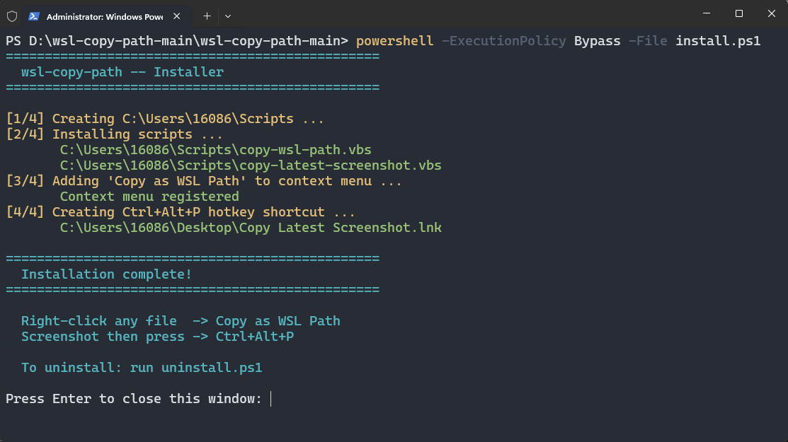
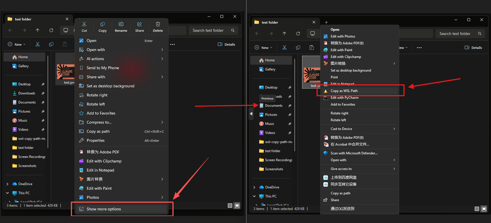

# wsl-copy-path

[English](#english) | [中文](#chinese)

---

<a name="english"></a>

Right-click any file or hit a hotkey after a screenshot — paste a WSL path into your terminal. No typing `/mnt/c/...` by hand.

## The Problem

You work in WSL2. You need to give a file path or a screenshot to Claude Code (or any terminal tool).

- Drag a file into the terminal → pastes `C:\Users\...` — WSL can't read that
- Copy an image from the clipboard → pastes nothing — terminals only accept text
- So you end up typing `/mnt/c/Users/you/...` by hand

## What This Does

Two things:

- **Right-click any file** → "Copy as WSL Path" — adds a context menu item in Explorer
- **Take a screenshot** → `Ctrl+Alt+P` — finds the newest screenshot, copies its WSL path

Both run silently. No terminal window pops up.

## Install

1. **Download** the project ZIP and extract it anywhere
2. **Open PowerShell** in the extracted folder
   - `Shift + Right-click` in the folder → "Open PowerShell window here"
   - Or `Win+R` → `powershell`, then `cd` to the folder
3. **Run the installer**:

```powershell
powershell -ExecutionPolicy Bypass -File install.ps1
```

No dependencies. No admin rights needed.



## Usage

### Copy a file's WSL path

1. Right-click any file (image, PDF, folder, whatever)
2. Click **"Copy as WSL Path"** *(Windows 11: first click "Show more options")*
3. Paste into your WSL terminal → `/mnt/c/Users/you/Documents/report.pdf`



### Copy the latest screenshot path

1. Take a screenshot (`Win+Shift+S` or `PrtSc`)
2. Press **`Ctrl+Alt+P`**
3. A balloon tip confirms the copy
4. Paste into your WSL terminal → `/mnt/c/Users/you/Pictures/Screenshots/screenshot.png`

## How It Works

Both features use the same mechanism:

1. A VBScript gets the Windows path (from the context menu argument, or by scanning the Screenshots folder)
2. Converts `C:\Users\...\file.png` → `/mnt/c/Users/.../file.png` (backslash to forward slash, drive letter to `/mnt/` prefix)
3. Pipes the result to `clip.exe` (built into Windows) which copies it to the clipboard

The VBScript runs via `wscript.exe` — the same host Windows uses for `.vbs` files — so no console window ever appears.

## Uninstall

Open PowerShell in the project folder and run:

```powershell
powershell -ExecutionPolicy Bypass -File uninstall.ps1
```

## Compatibility

- Windows 10 / 11
- WSL2 (any distro)
- Windows Terminal, VS Code integrated terminal, any WSL terminal

## Files

```
├── install.ps1                       # Adds context menu + hotkey shortcut
├── uninstall.ps1                     # Removes everything cleanly
├── img/
│   ├── installation.png              # Install screenshot
│   └── use.png                       # Usage screenshot
└── scripts/
    ├── copy-wsl-path.vbs             # Context menu handler
    └── copy-latest-screenshot.vbs    # Hotkey handler
```

---

<a name="chinese"></a>

右键任意文件，或截图后按一个热键——WSL 路径直接进剪贴板。不用再手敲 `/mnt/c/...`。

## 痛点

你在 WSL2 里用 Claude Code 或其他命令行工具，想把文件路径或截图传给终端：

- 拖拽文件到终端 → 粘贴的是 `C:\Users\...`，WSL 无法识别
- 截图/网页复制图片 → 粘贴不出来，终端只接受文本
- 只能每次手动敲 `/mnt/c/Users/xxx/...`

## 干什么

两件事：

- **右键任意文件** → "Copy as WSL Path" — 资源管理器增加右键菜单
- **截图后** → `Ctrl+Alt+P` — 自动找最新截图，复制 WSL 路径到剪贴板

全程不弹终端窗口。

## 安装

1. **下载**项目 ZIP 并解压到任意位置
2. 在解压后的文件夹中**打开 PowerShell**
   - 文件夹空白处 `Shift + 右键` → "在此处打开 PowerShell 窗口"
   - 或 `Win+R` → 输入 `powershell`，然后 `cd` 到该文件夹
3. **运行安装脚本**：

```powershell
powershell -ExecutionPolicy Bypass -File install.ps1
```

无依赖，无需管理员权限。


## 使用

### 复制文件 WSL 路径

1. 在资源管理器中右键任意文件（图片、PDF、文件夹都行）
2. 点击 **"Copy as WSL Path"** *（Windows 11 需先点 "显示更多选项"）*
3. 回到 WSL 终端粘贴 → `/mnt/c/Users/you/Documents/report.pdf`


### 复制最新截图路径

1. 截图（`Win+Shift+S` 或 `PrtSc`）
2. 按 **`Ctrl+Alt+P`**
3. 右下角弹出气泡确认
4. 回到 WSL 终端粘贴 → `/mnt/c/Users/you/Pictures/Screenshots/屏幕截图.png`

## 原理

两个功能走同一套流程：

1. VBScript 拿到 Windows 路径（右键菜单传入的文件路径，或扫描 Screenshots 文件夹拿到最新截图路径）
2. 把 `C:\Users\...\file.png` 转成 `/mnt/c/Users/.../file.png`（反斜杠换正斜杠，盘符换成 `/mnt/` 前缀）
3. 管道输给 `clip.exe`（Windows 自带），写入剪贴板

VBScript 通过 `wscript.exe` 运行——这是 Windows 原生执行 `.vbs` 的宿主，不会弹出控制台窗口。

## 卸载

在项目文件夹下打开 PowerShell，运行：

```powershell
powershell -ExecutionPolicy Bypass -File uninstall.ps1
```

## 兼容性

- Windows 10 / 11
- WSL2（任意发行版）
- Windows Terminal、VS Code 集成终端、各种 WSL 终端

## 文件

```
├── install.ps1                       # 添加右键菜单 + 热键快捷方式
├── uninstall.ps1                     # 清理所有安装内容
├── img/
│   ├── installation.png              # 安装截图
│   └── use.png                       # 使用截图
└── scripts/
    ├── copy-wsl-path.vbs             # 右键菜单处理脚本
    └── copy-latest-screenshot.vbs    # 热键处理脚本
```

## License

MIT
